# Design and Implementation of a Transaction Data Warehouse for a PC Gaming Platform

## Transaction Data Warehouse for PC Gaming Platform

This report designs a transaction data warehouse for a PC gaming platform. The primary business of this gaming platform is a game store, and it also provides player community services. Mainstream gaming platforms in the current market include Steam, Epic, and others. These platforms almost monopolize the vast majority of transactions in the PC gaming market. The existence of gaming platforms connects game developers, market tax benefits, player entertainment value, and other elements. Their activity levels result in a large amount of data being generated every moment globally. Integrating, selecting, cleaning, filtering, and effectively analyzing this data, especially transaction data, holds significant decision-making and management value.

Based on the above motivation, this paper imagines a PC gaming platform and establishes its business database. For the purpose of analyzing its transaction data, data warehouse modeling is conducted on the transaction information generated by this database. This document serves as a project description, showcasing the design and implementation of the PC gaming transaction platform data warehouse through modules such as business database, data warehouse modeling, ETL design, and BI visualization analysis.

It should be noted that all data used in this project is fictional. Information such as developer revenue sharing, game pricing, and discount strategies mentioned in this paper is generated by random functions. The data itself has no real-world correlation or practical significance. Some text information comes from the Random Word Generator, whose results are allowed for commercial and non-commercial use (website: <https://randomwordgenerator.com/sentence.php>).

### Business Overview

Referring to mainstream gaming platforms in the market, the business model of the imagined gaming platform in this project primarily involves the transaction of game software usage rights. The process can be summarized as establishing contact with game publishers, who release games on the platform. Profits generated from games purchased by players are shared between the platform and the publishers (publishers then share with developers, which is unrelated to the platform's business). The business database is mainly designed to provide game store services and lacks the capability to integrate and analyze information sufficient for business decision-making.

The imaginary gaming platform business database is divided into three business components: game store business (blue), player account business (green), order records (orange), and additional generic information tables (gray), as shown in section 1.3 Business Database Model Relationship Diagram.

### Business Data Table Design

(1) Producer Table

> The producer table records relevant information about game publishers, including ID, publisher name, etc.

| Field Name   | Data Type | Primary Key | Description                              |
|--------------|-----------|-------------|------------------------------------------|
| producer_id  | int       | Yes         | Game Publisher ID                        |
| name         | tinytext  | No          | Game Publisher Name                      |
| description  | tinytext  | No          | Game Publisher Description               |
| region_id    | int       | No          | Publisher Location ID                    |
| share_rule   | double    | No          | Revenue Sharing Rule with Publisher      |
| last_update  | datetime  | No          | Last Update Date                         |

---

(2) Discount Table

> The discount table records discount event information. The index is discount_id. Generally, determining whether a game is eligible for a discount requires two conditions:

a. The game is eligible for the discount rule (select discount_id from store_page where discount_id <> NULL, select discount_id to connect to the discount table).

b. The game is within the valid discount period (... where start_date < last_update < end_date).

| Field Name   | Data Type | Primary Key | Description                |
|--------------|-----------|-------------|----------------------------|
| discount_id  | int       | Yes         | Discount Rule ID            |
| discount_rate| double    | No          | Discount Rate               |
| start_date   | datetime  | No          | Discount Start Date         |
| end_date     | datetime  | No          | Discount End Date           |
| last_update  | datetime  | No          | Last Update Date            |

---

(3) Language Table

> The language table stores language names to determine applicable game languages.

| Field Name   | Data Type | Primary Key | Description      |
|--------------|-----------|-------------|------------------|
| language_id  | int       | Yes         | Language ID      |
| name         | tinytext  | No          | Language Name    |
| last_update  | datetime  | No          | Last Update Date |

---

(4) Region Table

> The region table stores region information, including tax rates, which can be used for calculating order costs and revenue.

| Field Name   | Data Type | Primary Key | Description        |
|--------------|-----------|-------------|--------------------|
| region_id    | int       | Yes         | Region ID          |
| name         | tinytext  | No          | Region Name        |
| language_id  | int       | No          | Applicable Language ID |
| tax_rate     | double    | No          | Tax Rate           |
| last_update  | datetime  | No          | Last Update Date   |

---

(5) Game Table

> The game table stores game information, including multiple foreign keys such as game developer ID and applicable language ID.

| Field Name   | Data Type | Primary Key | Description          |
|--------------|-----------|-------------|----------------------|
| game_id      | int       | Yes         | Game ID              |
| name         | tinytext  | No          | Game Name            |
| description  | tinytext  | No          | Game Description     |
| release_date | datetime  | No          | Game Release Date    |
| producer_id  | int       | No          | Publisher ID         |
| language_id  | int       | No          | Applicable Language ID |
| last_update  | datetime  | No          | Last Update Date     |

---

(6) Player Account Table

> The player_account table stores player account information, with the player's real-name information ID serving as a foreign key connected to the player_info table (real-name information table). The purpose of this design is to enhance the business database's standardization, as a real-name player may have multiple game accounts, making it inappropriate to use account ID as the primary key for both real-name and account information.

| Field Name   | Data Type | Primary Key | Description             |
|--------------|-----------|-------------|-------------------------|
| player_id    | int       | Yes         | Player Account ID        |
| verify_id    | int       | No          | Player Real-Name Information ID |
| nickname     | tinytext  | No          | Player Nickname          |
| account_level| int       | No          | Account Level            |
| create_date  | datetime  | No          | Account Creation Date    |
| region_id    | int       | No          | Region ID                |
| email_address| tinytext  | No          | Email Address            |
| last_update  | datetime  | No          | Last Update Date         |

---

(7) Player Info Table

> The player_info table stores player real-name information. The age information will be used to check if the account is restricted.

| Field Name   | Data Type | Primary Key | Description      |
|--------------|-----------|-------------|------------------|
| verify_id    | int       | Yes         | Real-Name Profile ID |
| real_name    | tinytext  | No          | Real Name        |
| citizen_number| tinytext | No          | ID Number        |
| age          | int       | No          | Age              |
| last_update  | datetime  | No          | Last Update Date |

---

(8) Store Page Table

> The store_page table stores store page information, i.e., sales information such as pricing.

| Field Name   | Data Type | Primary Key | Description          |
|--------------|-----------|-------------|----------------------|
| game_id      | int       | Yes         | Game ID              |
| original_price| double   | No          | Original Price       |
| last_update  | datetime  | No          | Last Update Date     |

---

(9) Email Address Table

> The email_address table stores email information, indexed by email_address_id. Each entity's (e.g., player, publisher) contact information profile is indexed by this key.

| Field Name        | Data Type | Primary Key | Description          |
|-------------------|-----------|-------------|----------------------|
| email_address_id   | int       | Yes         | Email Profile ID     |
| email_prefix       | tinytext  | No          | Email Address Prefix |
| email_suffix_id    | int       | No          | Email Address Suffix ID |
| last_update        | datetime  | No          | Last Update Date     |

---

(10) Email Suffix Table

> The email_suffix table is designed for business database standardization. The email provider identification segment after "@" in all email profiles generates a lot of repetition, so this table is created separately.

| Field Name       | Data Type | Primary Key | Description           |
|------------------|-----------|-------------|-----------------------|
| email_suffix_id  | int       | Yes         | Email Address Suffix ID |
| suffix           | tinytext  | No          | Email Address Suffix  |
| last_update      | datetime  | No          | Last Update Date      |

---

(11) Sale Table

> The sale table records order information.

| Field Name   | Data Type | Primary Key | Description          |
|--------------|-----------|-------------|----------------------|
| sale_id      | int       | Yes         | Order ID             |
| game_id      | int       | No          | (Purchased) Game ID  |
| player_id    | int       | No          | (Buyer) Player ID    |
| sale_date    | datetime  | No          | Transaction Date     |
| last_update  | datetime  | No          | Last Update Date     |

---

### Business Database Model Relationship Diagram

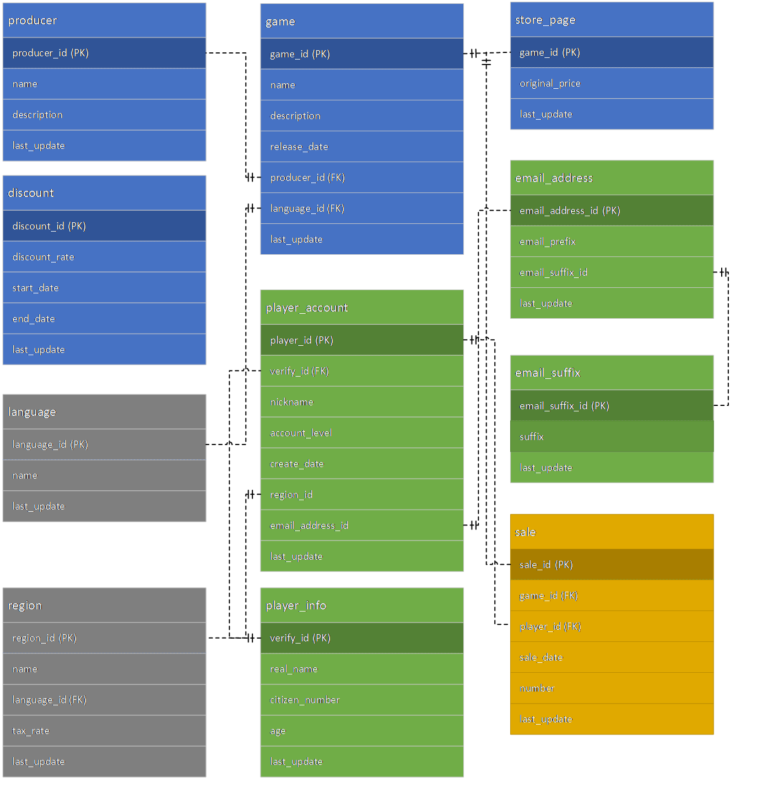

### Analysis of PC Gaming Platform Transaction Data Warehouse Goals

> In the commercial model of a gaming platform, profitability is influenced by multiple factors.
>
> For example, a player's single purchase on the platform (e.g., buying a game) results in actual profit influenced by regional taxes, game publisher shares, and whether the platform has discount policies at that time (discount policies may depend on game, region, period, or a combination thereof). These dimensions collectively impact the profit a transaction brings to the platform.
>
> However, due to the strong discreteness of these dimensions in commercial attributes (for example, the tax rules in a certain region of Asia might be stored in a database built, managed, or maintained by the platform's Asian branch, while those in a certain region of Europe might be stored in a database of the European branch), integrating and analyzing these data to optimize business decisions is challenging.
>
> Therefore, establishing a data warehouse aimed at providing business decision analysis on order profits and player group components becomes necessary. This data warehouse should be capable of cleaning, selecting, and integrating transaction data from multiple business databases or different data tables within a business database. Its design should support:

1. Transaction Profit Analysis:

> Based on sales order data, extract information required to calculate net profit from different business data tables, such as local taxes and discount policies, calculate the actual profit brought by orders to the platform, analyze the importance and results of influencing factors, and use this to optimize business decisions.

2. Player Group Component Analysis:

> In any commercial model, consumer profiling is a key factor in optimizing business models, services, and products, and providing targeted business strategies. For gaming platforms, its consumers are player groups. Analyzing this group's information and behavior patterns (such as age distribution, gender distribution) helps optimize business decisions.
>
> This report will focus on the implementation of transaction profit analysis.

# Establishing the PC Gaming Platform Transaction Data Warehouse

### Conceptual Model of the PC Gaming Platform Transaction Data Warehouse

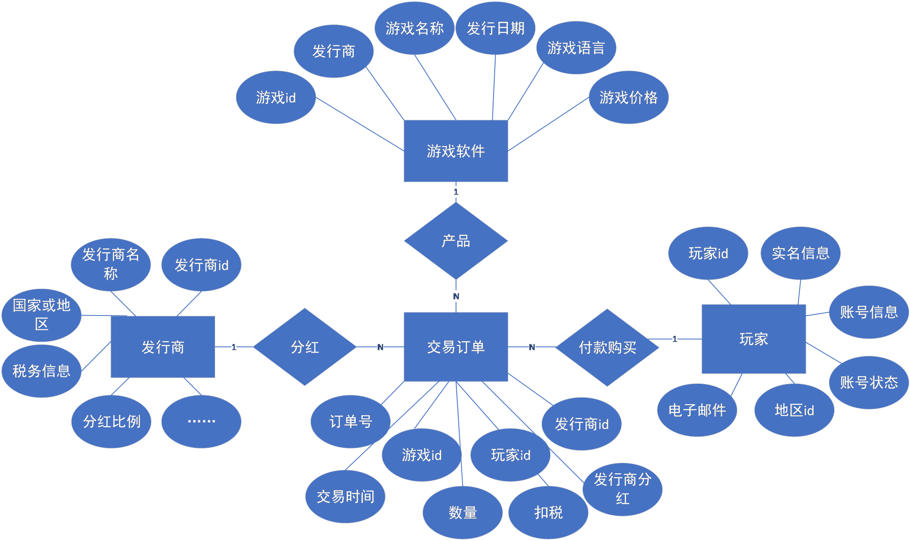

### Logical Model of the PC Gaming Platform Transaction Data Warehouse

Transaction Order Batch Fact Logical Model

{width="5.702579833770779in"
height="4.20587489063867in"}

Introduction to Dimension Tables and Fact Tables

- **dim_date**: Time dimension, static, records date information.

- **dim_game**: Game dimension, dynamic, records game information, including publisher, release date, price, etc.

- **dim_producer**: Publisher dimension, dynamic, records publisher information, including its name, region's tax rate, and contracted revenue sharing ratio.

- **dim_player**: Player dimension, dynamic, records player account information and player real-name information. Includes player account level, real-name ID number, whether the account is restricted, email address, etc.

- **fact_deal**: Transaction order fact table, records transaction order data, including purchase quantity, order total amount, tax deduction, publisher revenue share, net profit, and other information.

### PC Gaming Platform Transaction Data Warehouse Table Design

### **dim_player Table**

| Column Name              | Type             | Description              | Example Value         |
|--------------------------|------------------|--------------------------|-----------------------|
| player_id                | int              | Player ID                | 1                     |
| real_name                | varchar(255)     | Player Real Name          | Jack Lee              |
| citizen_number           | varchar(255)     | ID Number                | 5338454274488630011    |
| nickname                 | varchar(63)      | Account Nickname          | RocketNumberOne       |
| account_level            | int              | Account Level            | 1                     |
| if_limited               | tinyint(1)       | Is Account Limited        | 1                     |
| integrated_email_address | tinytext         | Complete Email Address    | abc@gmail.com         |
| last_update              | datetime         | Last Update Date          | 2012-1-1 12:00:00     |
| player_key               | bigint AI PK     | Update Key               | 1                     |
| player_version_number    | int              | Update Version Number     | 1                     |
| player_valid_from        | datetime         | Valid From               | 2012-1-1 12:00:00     |
| player_valid_through     | datetime         | Valid Through            | 2012-1-1 12:00:00     |

---

### **dim_producer Table**

| Column Name               | Type             | Description               | Example Value        |
|---------------------------|------------------|---------------------------|----------------------|
| producer_id               | int              | Publisher ID               | 1                    |
| name                      | varchar(63)      | Publisher Name             | Ubisoft              |
| share_rule                | double           | Revenue Sharing Rule       | 0.01                 |
| region_name               | varchar(255)     | Publisher Region Name      | Iceland              |
| tax_rate                  | decimal(22,0)    | Region Tax Rate            | 0.01                 |
| producer_key              | bigint AI PK     | Update Key                | 180                  |
| producer_version_number   | int              | Update Version Number      | 2                    |
| producer_valid_from       | datetime         | Valid From                | 2022-11-20 08:20:15  |
| producer_valid_through    | datetime         | Valid Through             | 2022-11-20 08:20:15  |
| last_update               | date             | Last Update Date           | 2012-1-1 12:00:00    |

---

### **dim_game Table**

| Column Name               | Type             | Description               | Example Value           |
|---------------------------|------------------|---------------------------|-------------------------|
| game_id                   | int              | Game ID                   | 1                       |
| game_version_number       | int              | Update Version Number      | 1                       |
| game_valid_from           | datetime         | Valid From                | 2022-11-20 08:20:15     |
| game_valid_through        | datetime         | Valid Through             | 2022-11-20 08:20:15     |
| last_update               | datetime         | Last Update Date           | 2012-1-1 12:00:00       |
| producer                  | varchar(255)     | Publisher Name             | Ubisoft                 |
| name                      | varchar(63)      | Game Name                 | League of Legends        |
| release_date              | datetime         | Release Date               | 2012-1-1 12:00:00       |
| language                  | varchar(255)     | Game Supported Language    | English                 |
| original_price            | decimal(22,0)    | Store Base Price           | 125.0                   |
| game_key                  | bigint AI PK     | Update Key                | 1                       |

---

### **dim_date Table**

| Column Name               | Type             | Description               | Example Value           |
|---------------------------|------------------|---------------------------|-------------------------|
| date_key                  | tinytext         | Date ID                   | 20000102                |
| date_value                | datetime         | Year-Month-Day             | 2000-01-02 00:00:00     |
| day_in_year               | int              | Day of Year               | 1                       |
| day_in_month              | int              | Day of Month              | 1                       |
| is_first_day_in_month     | tinytext         | Is First Day of Month     | yes                     |
| is_last_day_in_month      | tinytext         | Is Last Day of Month      | yes                     |
| week_in_year              | int              | Week of Year              | 1                       |
| month_number              | int              | Month                     | 1                       |
| year4                     | int              | Year                      | 2000                    |
| quarter_name              | tinytext         | Quarter Name              | Q1                      |
| quarter_number            | int              | Quarter                   | 1                       |
| year_quarter              | tinytext         | Year-Quarter              | 2000-Q1                 |
| year_month_number         | tinytext         | Year-Month                | 2000-01                 |

---

### **fact_deal Table**

| Column Name                        | Type             | Description               | Example Value           |
|------------------------------------|------------------|---------------------------|-------------------------|
| sale_id                            | int              | Order ID                  | 1                       |
| game_id                            | int              | Game ID                   | 1                       |
| player_id                          | int              | Player ID                 | 1                       |
| producer_id                        | int              | Publisher ID              | 1                       |
| sale_date                          | datetime         | Transaction Date          | 2022-11-20 08:20:15     |
| language_id_game                   | int              | Game Language ID          | 1                       |
| If_default_language_supported      | tinyint(1)       | Supports Player Language  | 1                       |
| If_available                       | tinyint(1)       | Is Order Rejected         | 1                       |
| total_revenue                      | double           | Total Revenue             | 80.4                    |
| tax_expense                        | double           | Tax Expense               | 30.2                    |
| share_expense                      | double           | Revenue Share Expense     | 20.5                    |
| net_profit                         | double           | Net Profit                | 120.5                   |
| last_update                        | datetime         | Last Update Date           | 2022-11-20 08:20:15     |
| sale_key                           | bigint AI PK     | Update Key                | 1                       |
| sale_version_number                | int              | Update Version Number      | 2                       |
| sale_valid_from                    | datetime         | Valid From                | 2022-11-20 08:20:15     |
| sale_valid_through                 | datetime         | Valid Through             | 2022-11-20 08:20:15     |

---

# Dimension and Fact Table ETL Design

1. **Publisher Dimension Table (dim_producer)**

3.1.1 Retrieve publisher field information from the business database:

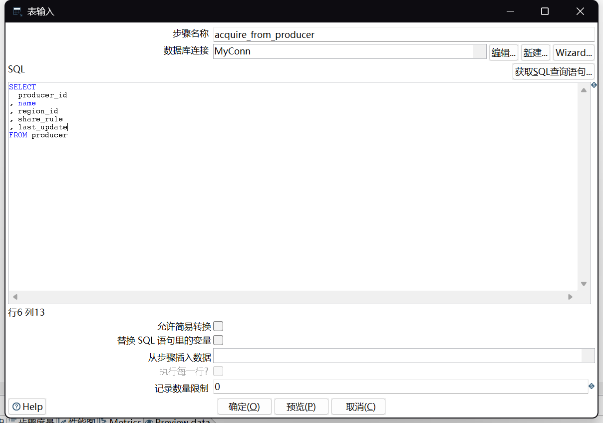{width="3.4031299212598425in"
height="2.386205161854768in"}

- Use the table input control to read publisher code, name
- Remove unnecessary data dimensions description
- Retrieve name, region_id to query its address, share_rule for revenue sharing ratio

3.1.2 Retrieve the publisher's country or region

{width="2.661492782152231in"
height="3.4833945756780405in"}

- Retrieve country or region name through region_id
- Delete index, language_id, two unnecessary dimensions (the image above still has language_id at the time of capture, but it was deleted)
- Retrieve language_id to find its language
- Retrieve tax_rate, the region's tax calculation rule, for future transaction profit calculation

3.1.3 As this table is a dynamic dimension table, it needs dynamic updates and maintenance:

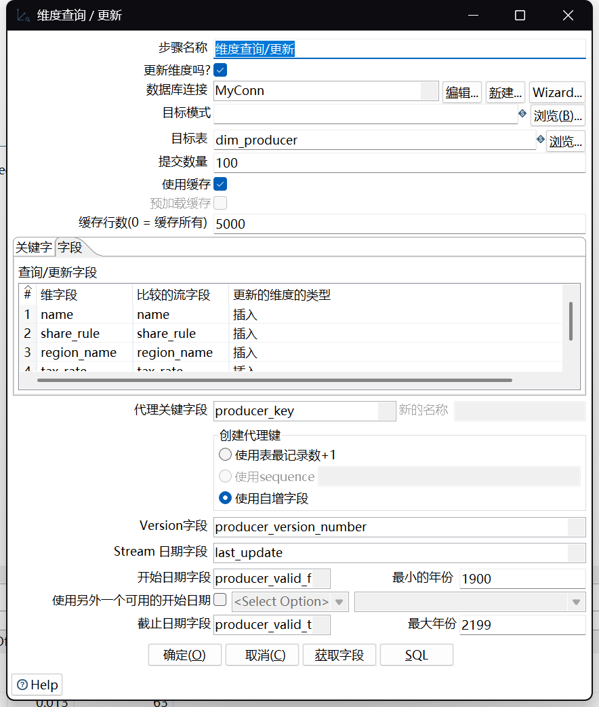{width="2.6805205599300086in"
height="3.159760498687664in"}

3.1.4 Use field selection to complete, create, and maintain the dim_producer dimension table

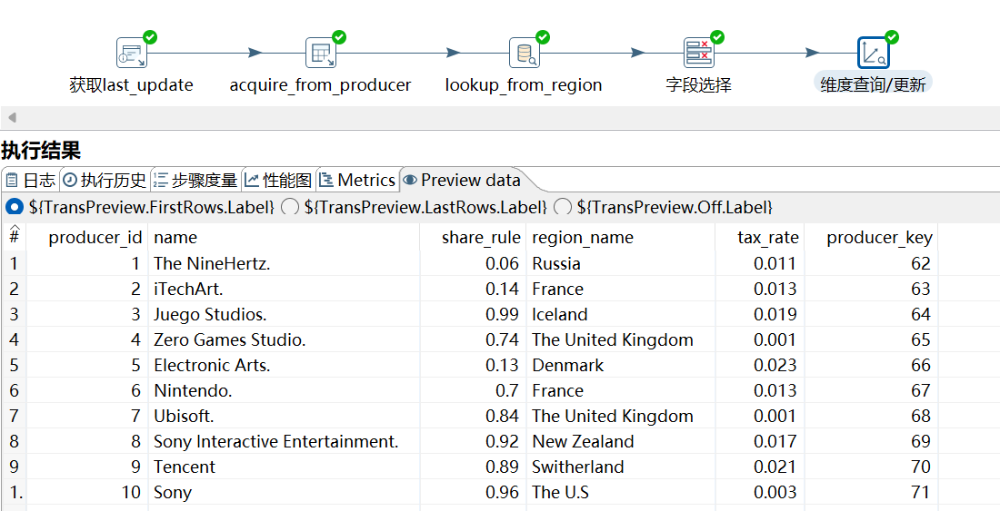{width="4.697084426946632in"
height="2.403961067366579in"}

Refer to the attached dim_producer.ktl

1. **Player Dimension Table (dim_player)**

3.2.1 Retrieve basic dimensions from the player account table

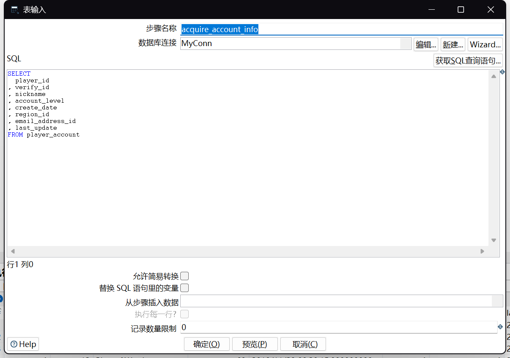{width="4.243064304461942in"
height="2.975150918635171in"}

- Player id 🡪 Primary Key;
- Verify_id is used to connect to the player_info table, the business database's player real-name information table;
- Email_address_id is used to connect to the email table: the business database stores the email prefix (custom content before @) in one table and the suffix (e.g., gmail.com) in another business table. Thus, this id is needed for query operations;

3.2.2 Query authentication information

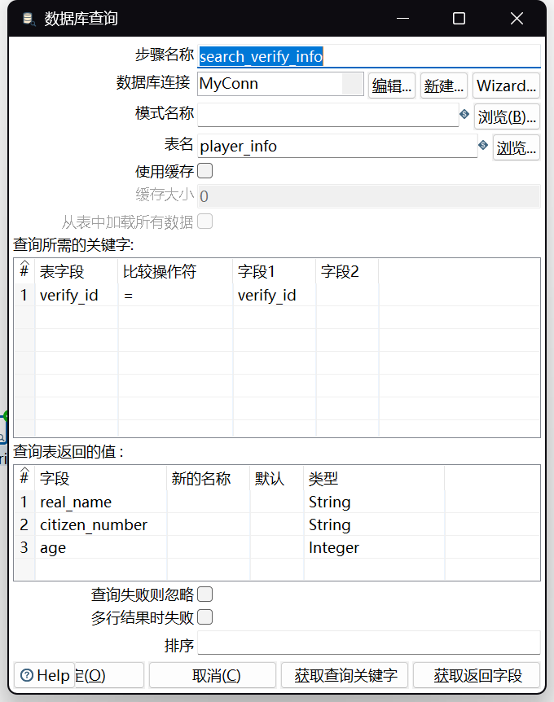{width="2.725479002624672in"
height="3.4549201662292215in"}

3.2.3 Retrieve player real-name profile to judge minor status (whether the platform activity is limited)

{width="3.069315398075241in"
height="1.2785739282589677in"}

- Use the record filter module for condition judgment
- Pass to add constant, add Bool value True or False to form if_limited dimension

3.2.4 Query player email address prefix and suffix, then combine

{width="3.0965912073490816in"
height="1.1471478565179352in"}

- First, query the prefix and email service provider (suffix content) id from email
- Then extract the suffix from email_suffix
- Add constant "@", and use concat field function to combine

    5. Perform field selection needed for dimension tables, as it's a dynamic dimension table, add an update module, complete dim_player

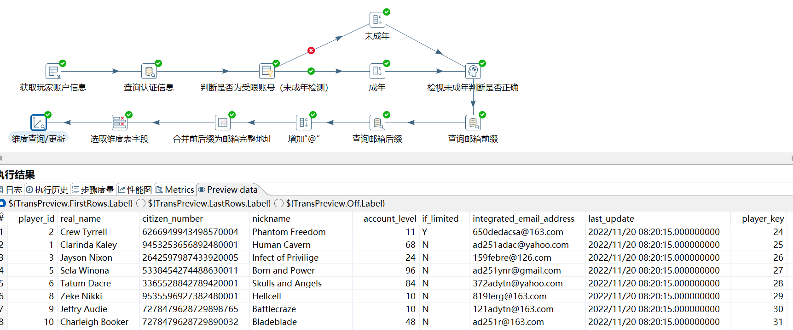{width="5.768055555555556in"
height="2.4069444444444446in"}

2. **Game Dimension Table (dim_game)**

    1. Retrieve basic information from the game table

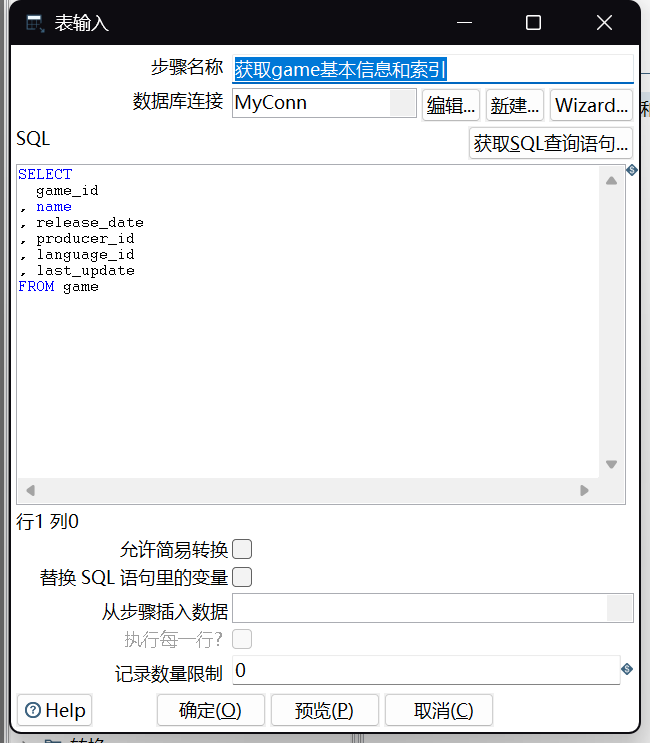{width="3.422212379702537in"
height="3.91169072615923in"}

2. Query price information, language information, publisher information

{width="2.8755479002624673in"
height="0.6502209098862642in"}

{width="3.3668810148731407in"
height="3.990725065616798in"}

3.3.3 Select needed fields and perform maintenance and updates, complete dim_game table maintenance

{width="3.993989501312336in"
height="1.596441382327209in"}

- Here, convert the date data in last_update to avoid mysql errors during the update table phase (since the original data was generated in Excel, stored in Excel's date format). This design demonstrates the data cleaning function of ETL.

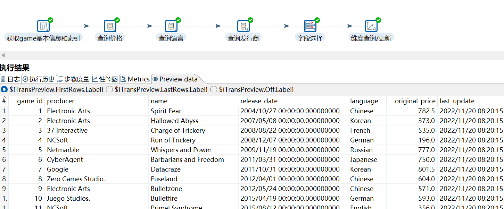{width="4.8515780839895015in"
height="2.016330927384077in"}

3. **Date Dimension Table (dim_date)**

Refer to the sakila project for generating various time and date dimensions, a static table, no detailed introduction.

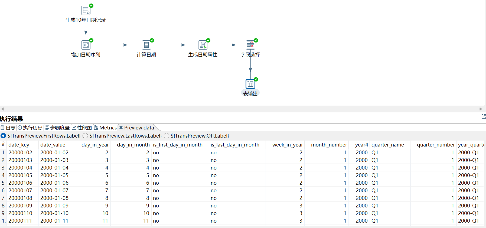{width="5.6388538932633425in"
height="2.6449518810148733in"}

4. **Transaction Order Fact Table (fact_deal)**

The fact table involves three main steps: determining whether the game supports the player's language, judging whether the order needs to be rejected, and calculating financial information. See the explanation video for detailed procedures.

1. Data Format Conversion

Assume that date data in business tables comes from different databases, resulting in different date storage formats, this step implements data cleaning.

{width="4.506041119860018in"
height="1.634562554680665in"}

2. Determine If Supports Player Language

{width="4.469127296587926in"
height="1.861687445319335in"}

- Query player language id and applicable game language id in the dimension table
- Use record filter to judge

    1. Calculate Tax & Revenue Sharing Costs

{width="4.420488845144357in"
height="1.9675590551181101in"}

- Retrieve rules required for financial information calculation
- Use calculator for calculation
- For rejected orders, use branching judgment, net profit is recorded as 0

    1. Perform Dimension Updates

{width="3.4850404636920387in"
height="4.07790791776028in"}

3.5.4 Full ETL Process of fact_deal Table (See explanation video for details)

{width="3.7843318022747154in"
height="2.708626421697288in"} {width="5.768055555555556in"
height="1.761111111111111in"}

# BI Visualization Analysis

(Since the original data is randomly generated, the results may not correspond to actual business logic)

4.1 Profit Analysis

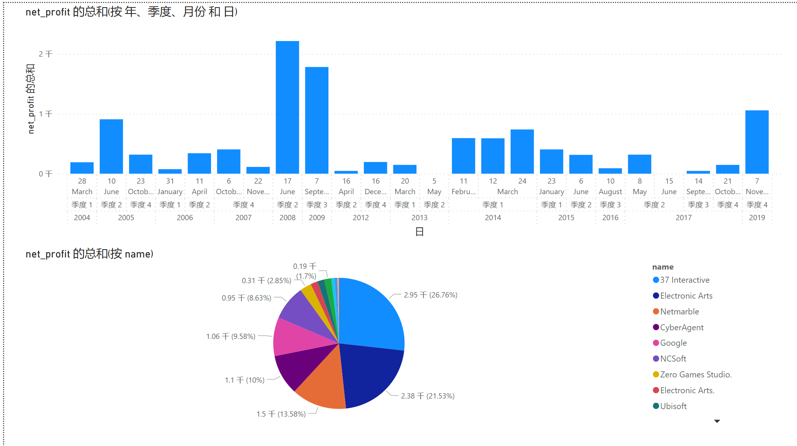{width="5.768055555555556in"
height="3.232638888888889in"}

- From the table above, it can be seen that profits were high in the second quarter of 2008 and the third quarter of 2009, exceeding 2000 dollars.
- The partner contributing the most to profit is 37 Interactive, accounting for 26.76% of net profit.
- From the table below, it can be seen that Germany is the largest market for this game store, and Russian games bring the highest profit.
- 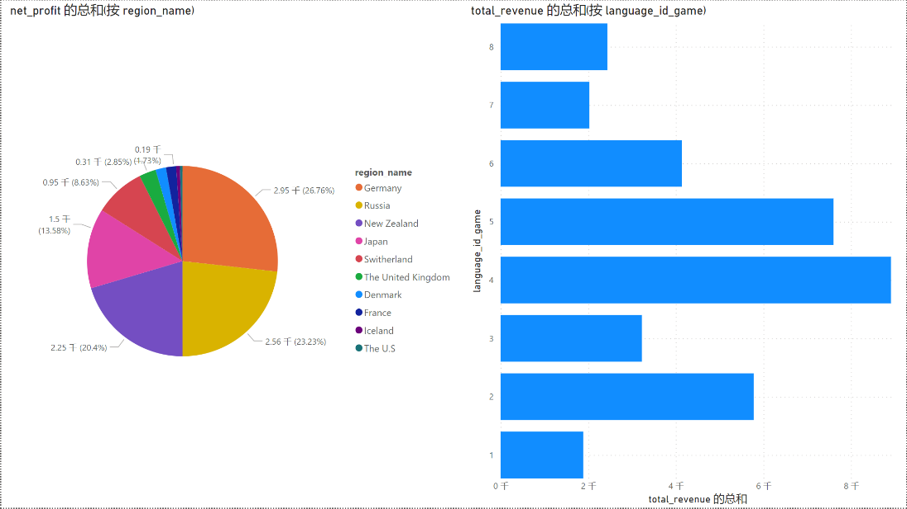{width="4.986805555555556in"
  height="2.807638888888889in"} Business suggestion: Promote in the second and third quarters; strengthen cooperation with 37 Interactive; enhance promotion in the German market; introduce more Russian games.
